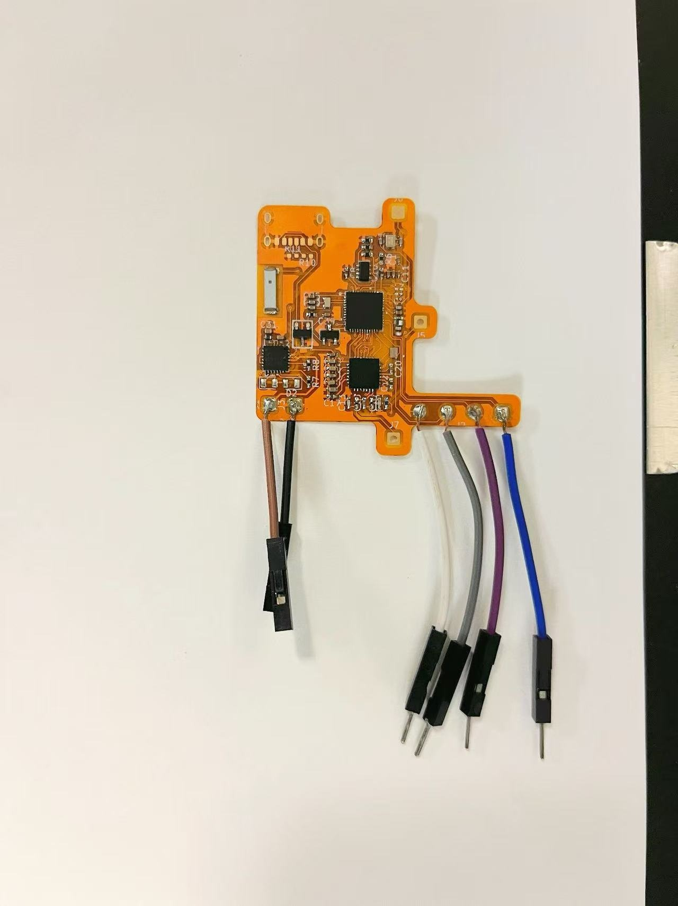
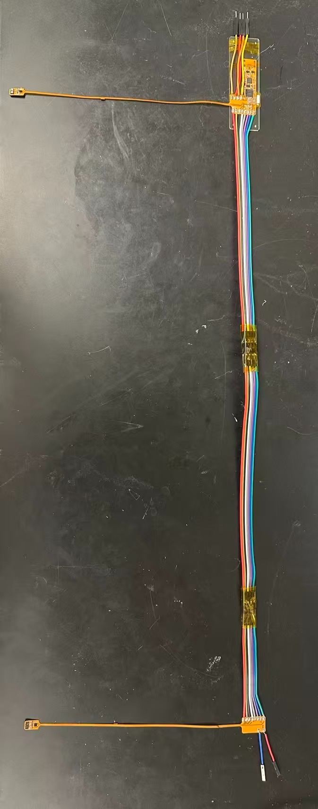
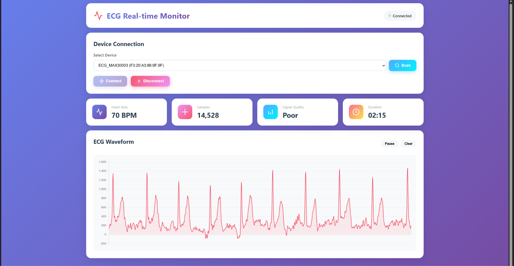

# Bilateral Earlobe Pulse Timing Measurement Device
**ECE 445 Senior Design Project - Spring 2026**

A custom PCB-based multi-channel physiological sensing platform for synchronized bilateral pulse transit time analysis. This project enables non-invasive cardiovascular monitoring by measuring pulse arrival time differences between left and right earlobes relative to ECG R-peaks.

---

## 🏆 Project Recognition
**Project #40**

This project demonstrates advanced biomedical sensing capabilities with sub-millisecond timing precision for bilateral cardiovascular dynamics research.

---

## 👥 Contributors

- **Zhikuan Zhang**
- **Joshua Joseph**
- **Mark Schmitt**

**Teaching Assistant:** Shiyuan Duan

---

## 📋 Problem Statement

Pulse arrival time (PAT) and pulse transit time (PTT) are widely studied non-invasive physiological metrics that reflect cardiovascular dynamics, vascular stiffness, and autonomic regulation. Conventional PTT systems measure the time delay between an ECG R-peak and a single peripheral photoplethysmography (PPG) waveform, but **do not enable synchronized bilateral comparisons** of pulse arrival times.

**Key Challenges:**
- Lack of low-cost hardware platforms with precise time synchronization
- Accurate bilateral PTT comparison requires **sub-millisecond alignment** between ECG and multiple PPG channels
- Existing research systems rely on independent sensors or software-based synchronization, introducing timing uncertainty
- No readily available tools for controlled bilateral pulse timing comparison between left and right earlobes

---

## 💡 Solution

Our system provides a **hardware-synchronized, three-channel physiological sensing platform** capable of simultaneously acquiring:

- **1 ECG channel** (cardiac timing reference from chest electrodes)
- **2 PPG channels** (synchronized left and right earlobe pulse waveforms)

### Key Design Features:
- ✅ **Low-noise analog front-end circuitry** for high-quality signal acquisition
- ✅ **Hardware-level time synchronization** using shared sampling clock architecture
- ✅ **Precise multi-channel ADC acquisition** with <1ms inter-channel timing jitter
- ✅ **Bluetooth Low Energy (BLE)** wireless data transmission
- ✅ **Sub-millisecond timing precision** for reliable bilateral pulse timing analysis

---

## 🎯 High-Level Requirements

1. **Microcontroller (nRF52840)** basic functions working normally:
   - Bluetooth Low Energy wireless connection
   - Data writing and reading
   - SPI communication
   - Charging system functioning properly

2. **MAX30003 ECG driver** functioning properly:
   - Collect ECG signals from any person
   - Display electrocardiogram dynamically via Bluetooth wireless transmission
   - ECG board fully operational

3. **Dual MAX86141 PPG drivers** working properly:
   - Drive LEDs to flash
   - Collect signals from photodiodes
   - Correctly plot PPG waveforms
   - Calculate PTT time difference between both earlobes

---

## 🔧 System Architecture

### Block Diagram
The system consists of three main PCB modules:

**ECG Board:**
- Power Subsystem (Battery → BMS → Voltage Regulator)
- ECG Analog Front-End Subsystem (Electrodes → Input Protection → MAX30003)
- Control Subsystem (nRF52840 + Timer/Timestamp)
- Wireless Subsystem (BLE Radio + 2.4GHz Antenna)

**PPG Boards (×2):**
- Power Subsystem (Battery → BMS → Voltage Regulator)
- Optical Sensing Subsystem (SFH-7050A LEDs + Photodiode → MAX86141)
- Control Subsystem (nRF52840 + Timer/Timestamp)
- Wireless Subsystem (BLE Radio + 2.4GHz Antenna)

All boards communicate wirelessly with a mobile device running a **PTT Calculator** app for real-time bilateral pulse timing analysis.

---

## 📐 Physical Design

- **Central wearable hub:** ~60mm × 40mm × 15mm
- **Two earlobe clips:** Spring-loaded design containing SFH-7050A optical sensors
- **ECG cable:** 3-lead configuration for chest placement
- **Battery-powered** with USB-C charging capability

---

## 📊 Technical Specifications

### Timing Accuracy Analysis
- **Sampling Rate:** 1000 Hz (1 ms period)
- **Quantization Uncertainty:** ±0.5 ms
- **Oscillator Drift:** 0.2 ms (±20 ppm over 10 seconds)
- **Inter-Channel Skew:** 0.01 ms
- **Total Timing Uncertainty:** ~0.71 ms ✅ (meets <1 ms requirement)

### Power Requirements
- **Regulated voltage:** 1.8V ± 0.2V DC from 3.7V LiPo battery
- **Voltage ripple:** <10 mV on MAX30003 AVDD pin
- **Total current draw:** <50 mA during active sensing
- **Battery life:** >10 hours on 500mAh battery

### Signal Quality
- **ECG:** 0.5–3 mV signal acquisition with R-peak detection
- **PPG:** >100 Hz sampling rate per channel
- **LED current:** Limited to 50% of max to prevent thermal discomfort

---

## 🛠️ Key Components

| Component | Part Number | Function |
|-----------|-------------|----------|
| Microcontroller | nRF52840-QFAA | BLE communication & data processing (×3) |
| ECG AFE | MAX30003CTI+ | Ultra-low power biopotential acquisition |
| PPG AFE | MAX86141 | Optical pulse sensing (×2) |
| Optical Sensor | SFH-7050A | LED + photodiode module (×2) |
| Power Management | NPM1100-QDAA-R7 | Battery charging & regulation (×3) |
| Voltage Regulators | TLV73318PDBVT, TLV76033DBZR | Low-noise power supply |

---

## 📱 Final Results

### ECG Board

### PPG Boards

### ECG Waveform Capture

---

## 🧪 Verification & Testing

### Power Subsystem
- ✅ Measure LDO output voltage under peak load (1.6V – 2V)
- ✅ Verify voltage ripple <10 mV using oscilloscope
- ✅ Confirm current draw <50 mA in Active Sensing Mode

### ECG Subsystem
- ✅ Verify 47kΩ safety resistors on electrode leads
- ✅ Confirm R-peak interrupt triggers within 5 ms
- ✅ Validate R-peaks distinguishable from T-waves and noise

### PPG Subsystem
- ✅ Verify dual-channel sampling >100 Hz using logic analyzer
- ✅ Confirm LED drive current settings via SPI registers
- ✅ Validate heart rate peaks visible in mobile app

### Data Acquisition
- ✅ Inject synchronized 1Hz pulse to verify <1 ms timestamp delta
- ✅ Test BLE connection stability at 3 meters distance
- ✅ Confirm hardware timestamps attached to transmitted data

---

## 🔬 Research Applications

This system enables investigation of:
- **Bilateral pulse arrival time differences** under various postural conditions
- **Head tilt effects** on cardiovascular timing
- **Asymmetric vascular conditions** that may indicate stroke risk
- **Autonomic regulation** through bilateral cardiovascular dynamics
- **Next-generation wearable health monitoring** technologies

⚠️ **Note:** This is a **research measurement tool**, not a clinical diagnostic device.

---

## 🛡️ Safety & Ethics

### Electrical Safety
- Battery-powered low-voltage operation
- Current-limiting protection on all electrode connections
- LED drive currents within manufacturer specifications
- Safe PCB design following medical device principles (IEC 60601 considerations)

### Data Privacy
- Anonymized physiological data collection
- Secure Bluetooth Low Energy transmission
- Limited storage access controls

### Research Compliance
- IRB approval obtained for human subject testing
- Clear communication of experimental device status
- Honest reporting of measurement accuracy and limitations per IEEE Code of Ethics

---

## 📅 Project Timeline

**Spring 2026 Schedule:**
- **Week 3/2:** PCB design & firmware initialization
- **Week 3/9:** Subsystem testing & breadboard demo
- **Week 3/23:** PPG & ECG integration
- **Week 3/30:** Software timing implementation
- **Week 4/6:** System integration & progress demo
- **Week 4/13:** Head-tilt verification testing & final demo preparation
- **Week 4/27:** Final presentation
- **Week 5/4:** Final report submission

---

## 🎤 Presentation

[View Project Presentation](https://docs.google.com/presentation/d/1ANw0dAJMYt3qXs6DZXwqXkPDi8zIwqQTNQY861npctc/edit?usp=sharing)

---

## 🎥 Demo

[Watch Project Demo](https://www.youtube.com/embed/-hJwNCSb4G8)

---

## 📚 References

- IEEE Code of Ethics: [www.ieee.org/about/corporate/governance/p7-8.html](https://www.ieee.org/about/corporate/governance/p7-8.html)
- Nordic Semiconductor nRF52840 Product Specification v1.11
- Analog Devices MAX30003 Datasheet Rev. 2
- Analog Devices MAX86141 Datasheet Rev. 5
- ams-OSRAM SFH 7050A BIOFY® Sensor Datasheet
- IEC 60601-1:2005+AMD1:2012 Medical Electrical Equipment Standards

---

## 🎓 Course Information

**University of Illinois Urbana-Champaign**
**ECE 445: Senior Design Project**
**Spring 2026**

---

## 📄 License

This project was completed as part of academic coursework at the University of Illinois. All design documents, schematics, and source code are for educational purposes.
